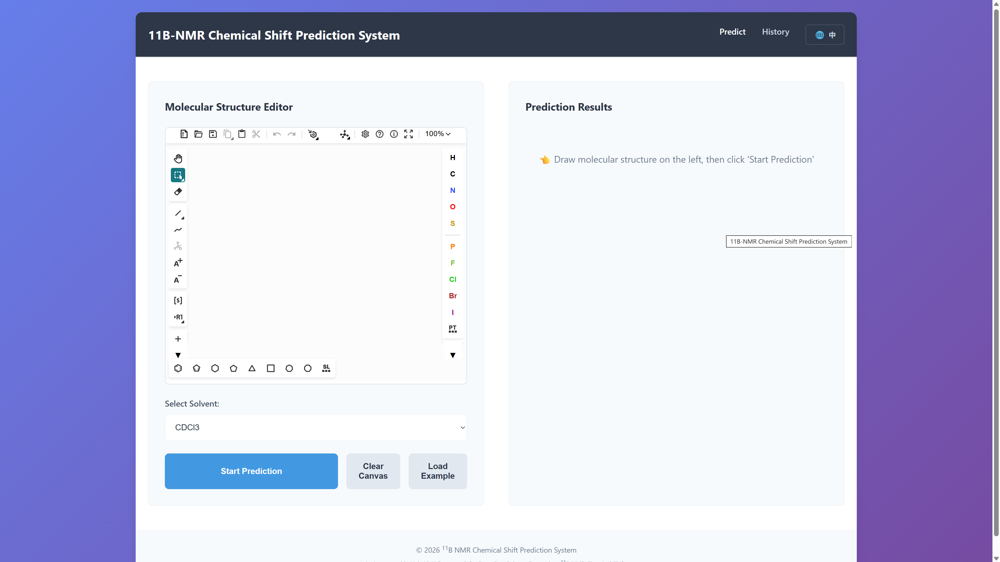

# An Interpretable Hybrid AI Framework for Decoding Solvent-Dependent <sup>11</sup>B NMR Chemical Shifts

This repository provides the code and data for predicting <sup>11</sup>B NMR chemical shifts using classical machine learning and graph neural networks. The framework combines a Graph Transformer with virtual node, learnable solvent embeddings, and SHAP-guided ML feature fusion, trained on a dataset of **5,490** boron-containing compounds across **10 deuterated solvents**. A Flask web application with Ketcher molecule editor is included for interactive prediction.

<p align="center">
  
</p>

---

## Project Structure

```
B11-NMR-Prediction/
├── data/                       # Raw datasets
│   ├── data_clean.csv          # Curated dataset (5,490 entries)
│   ├── nmr_11b_bookdata.csv    # NMR data from textbooks
│   └── nmr_11b_paperdata.csv   # NMR data from literature
│
├── classical_ml/               # Classical ML benchmarks (Chemia framework)
│   ├── configs/                # 33 YAML configs (11 representations × 3 seeds)
│   ├── data/                   # Single-ppm subset (5,217 entries)
│   ├── results/                # Full comparison results
│   ├── Morgan-RDKit_seed44_xgboost/  # Best model + SHAP analysis
│   └── README.md
│
├── gnn/                        # Graph Neural Network models
│   ├── graph_transformer/      # Best model: Graph Transformer + ML fusion
│   ├── graph_transformer_no_ml/# Ablation: without ML features
│   ├── gnn_comparison/         # Benchmark: GCN, GATv2, GINE, NNConv, PNA
│   ├── gnn_comparison_no_ml/   # Benchmark: same architectures without ML
│   ├── requirements.txt
│   └── README.md
│
├── web_app/                    # Flask web GUI for interactive prediction
│   ├── app.py                  # Flask application
│   ├── core/                   # Model, features, predictor modules
│   ├── database/               # SQLite database models
│   ├── models/                 # Trained model weights (5-fold)
│   ├── static/                 # CSS, JS, Ketcher molecule editor, i18n
│   ├── templates/              # HTML templates (Jinja2)
│   ├── utils/                  # Validators, exceptions
│   ├── requirements.txt
│   └── start.sh
│
├── LICENSE
└── README.md                   # This file
```

---

## Dataset

The curated dataset (`data/data_clean.csv`) contains **5,490 entries** of boron-containing compounds with experimentally measured <sup>11</sup>B NMR chemical shifts, covering **10 deuterated solvents**.

| Column | Description |
|---|---|
| `Smiles` | SMILES of the boron-containing compound |
| `solvent` | SMILES of the deuterated NMR solvent |
| `B_count` | Number of boron atoms in the molecule |
| `ppm_values` | <sup>11</sup>B NMR chemical shift (ppm); multiple values separated by commas |

**Supported solvents:** CDCl3, C6D6, DMSO-d6, Acetone-d6, CD3CN, CD3OD, CD2Cl2, THF-d8, Toluene-d8, D2O.

---

## Model Overview

### Classical ML (XGBoost)

11 molecular representations (Morgan, MACCS, RDKit descriptors, MolT5, UniMol, and their combinations) were benchmarked with 7 regression algorithms. The best combination is **Morgan + RDKit Descriptors with XGBoost**.

See [`classical_ml/README.md`](classical_ml/README.md) for full results.

### Graph Transformer (Best Model)

A 3-layer Graph Transformer (TransformerConv) with:
- **Virtual Node** mechanism for global message passing
- **Learnable solvent embeddings** (10 solvents + unknown)
- **SHAP Top-20 ML feature fusion** from the best XGBoost model
- 5-fold cross-validation with ensemble prediction

See [`gnn/README.md`](gnn/README.md) for architecture details and other GNN benchmarks.

---

## Quick Start

### 1. Predict with the trained model (command line)

```bash
cd gnn/graph_transformer

# Prepare dataset (one-time)
python csv_to_pyg.py
python build_dataset_v3.py

# Edit MOLECULE_SMILES and SOLVENT_SMILES in the script, then run:
python inference/predict.py
```

### 2. Launch the web GUI

```bash
cd web_app
pip install -r requirements.txt
python app.py
```

Then open the browser at `http://localhost:5000`. Draw a molecule with the built-in Ketcher editor or enter a SMILES string, select a solvent, and click **Predict**.

### 3. Retrain models

**Classical ML** (requires [Chemia](https://github.com/flyben97/Chemia)):

```bash
conda activate chemia
python scripts/run_training_only.py classical_ml/configs/morgan_rdkit_seed44.yaml
```

**Graph Transformer**:

```bash
cd gnn/graph_transformer
pip install -r ../requirements.txt
python train_kfold_v3.py
```

---

## Requirements

- Python 3.10+
- PyTorch 2.5+ (CUDA 12.1 recommended for GPU training)
- PyTorch Geometric 2.7+
- RDKit 2025+
- See `gnn/requirements.txt` and `web_app/requirements.txt` for full dependency lists

---

## License

This project is licensed under the [MIT License](LICENSE).

This project is licensed for academic and research use. Please contact the authors for commercial inquiries.
