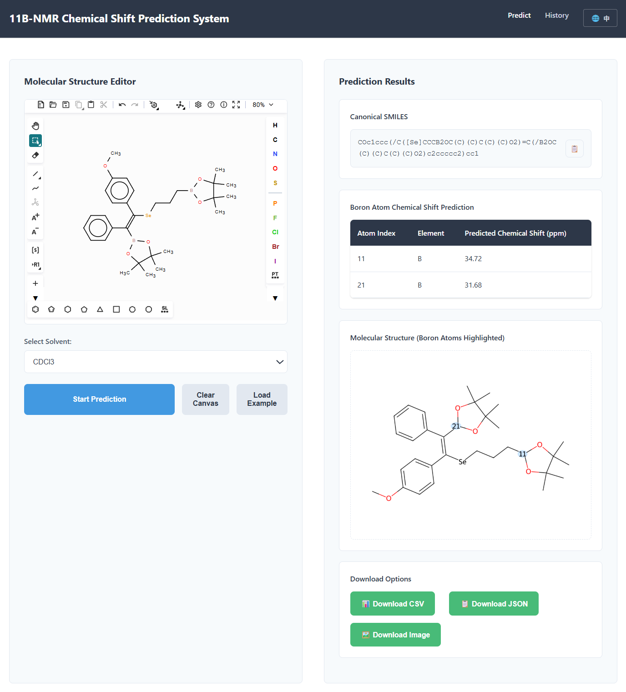

# 硼核磁预测系统

[English](README.md) | 简体中文

基于图神经网络（GNN）的 <sup>11</sup>B-NMR 化学位移预测 Web 应用

## 界面预览



*主界面展示了 Ketcher 分子编辑器（左侧）和预测结果面板（右侧）*

> **注意**：如果看不到上面的图片，请将截图添加到 `docs/images/web-interface.png`

## 项目简介

这是一个使用深度学习预测硼原子核磁共振（<sup>11</sup>B-NMR）化学位移的 Web 应用。系统采用图神经网络（Graph Neural Network）架构，结合 5 折交叉验证集成模型，能够准确预测含硼分子在不同氘代溶剂中的化学位移值。

### 主要功能

**分子编辑器（左侧）**
- 🎨 Ketcher 可视化分子编辑器
- ⚛️ 支持绘制复杂分子结构
- 🔧 完整的化学绘图工具

**预测功能（右侧）**
- 🔬 选择 10 种氘代溶剂
- 🤖 5 个模型集成预测
- 📊 实时结果展示
- 💾 自动保存历史记录

**结果展示**
- 📋 预测表格（原子索引、元素、ppm 值）
- 🖼️ 分子结构图（硼原子高亮显示）
- 📥 多格式下载（CSV、JSON、PNG）

## 主要特性

- 🧪 **分子编辑器**：集成 Ketcher 分子编辑器，支持可视化绘制分子结构
- 🔬 **多溶剂支持**：支持 10 种常用氘代溶剂（CDCl3、C6D6、DMSO-d6 等）
- 🤖 **集成预测**：使用 5 个交叉验证模型的集成预测，提高准确性
- 📊 **结果可视化**：自动生成分子结构图，高亮显示硼原子位置
- 💾 **历史记录**：保存所有预测记录，支持查看和下载
- 📥 **多格式导出**：支持 CSV、JSON、PNG 格式下载

## 快速开始

### 环境要求

- Python 3.8+
- 4GB+ RAM（推荐 8GB）
- 现代浏览器（Chrome、Firefox、Safari、Edge）

### 安装步骤

```bash
# 1. 克隆项目
git clone https://github.com/your-username/boron-nmr-predictor.git
cd boron-nmr-predictor/web_app

# 2. 创建虚拟环境
python -m venv venv
source venv/bin/activate  # Linux/Mac
# 或
venv\Scripts\activate  # Windows

# 3. 安装依赖
pip install -r requirements.txt

# 4. 下载模型文件
# 从 Google Drive 下载：https://drive.google.com/drive/folders/1HLirbH9JOf6HvgwUTIUETkpXG_U4fPYl?usp=sharing
# 将 5 个 .pth 文件放到 web_app/models/ 目录

# 5. 启动应用
python app.py
```

### 访问应用

在浏览器中打开：http://localhost:5000

## 使用说明

1. 在分子编辑器中绘制含硼分子结构（或直接输入 SMILES）
2. 选择溶剂类型
3. 点击"预测"按钮
4. 查看预测结果和分子结构图
5. 可选：下载结果（CSV/JSON/PNG）

## 支持的溶剂

| 溶剂 | 化学式 |
|------|--------|
| CDCl3 | 氘代氯仿 |
| C6D6 | 氘代苯 |
| DMSO-d6 | 氘代二甲亚砜 |
| Acetone-d6 | 氘代丙酮 |
| CD3CN | 氘代乙腈 |
| CD3OD | 氘代甲醇 |
| CD2Cl2 | 氘代二氯甲烷 |
| THF-d8 | 氘代四氢呋喃 |
| Toluene-d8 | 氘代甲苯 |
| D2O | 重水 |

## 技术栈

- **后端**：Flask 3.0
- **深度学习**：PyTorch 2.1 + PyTorch Geometric 2.4
- **化学信息学**：RDKit 2023.9
- **前端**：原生 JavaScript + Ketcher 分子编辑器
- **数据库**：SQLite3

## 项目结构

```
boron-nmr-predictor/
├── README.md                 # 项目说明（英文）
├── README_CN.md              # 项目说明（中文）
├── INSTALL.md                # 安装指南
├── CONTRIBUTING.md           # 贡献指南
├── LICENSE                   # MIT 许可证
├── .gitignore               # Git 忽略规则
└── web_app/                 # Web 应用
    ├── app.py               # Flask 主应用
    ├── config.py            # 配置文件
    ├── requirements.txt     # Python 依赖
    ├── core/                # 核心预测逻辑
    ├── database/            # 数据库操作
    ├── utils/               # 工具函数
    ├── templates/           # HTML 模板
    ├── static/              # 静态资源
    └── models/              # 模型文件（需下载）
```

## 文档

- [安装指南](INSTALL.md) - 详细的安装步骤
- [上传指南](UPLOAD_TO_GITHUB.md) - 如何上传到 GitHub
- [贡献指南](CONTRIBUTING.md) - 如何参与贡献
- [项目信息](PROJECT_INFO.md) - 项目详细信息

## 常见问题

**Q: 模型加载失败？**  
A: 确保已下载所有 5 个模型文件并放置在 `web_app/models/` 目录。

**Q: Ketcher 编辑器无法加载？**  
A: 应用会自动降级到 SMILES 输入框，功能不受影响。

**Q: 预测速度慢？**  
A: 首次预测需要加载模型（约 3-5 秒），后续预测会更快。如有 GPU 可显著加速。

## 贡献

欢迎提交 Issue 和 Pull Request！详见 [贡献指南](CONTRIBUTING.md)。

## 许可证

本项目采用 MIT 许可证 - 详见 [LICENSE](LICENSE) 文件。

## 引用

如果您在研究中使用了本项目，请引用：

```bibtex
@software{boron_nmr_predictor,
  title = {Boron NMR Chemical Shift Predictor},
  author = {Your Name},
  year = {2025},
  url = {https://github.com/your-username/boron-nmr-predictor}
}
```

## 联系方式

- 项目主页：https://github.com/your-username/boron-nmr-predictor
- 问题反馈：https://github.com/your-username/boron-nmr-predictor/issues
